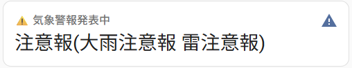

# Home Assistant Japan Meteorological Agency Disaster Information Integration

A Home Assistant custom integration that provides real-time disaster information for Japan, including weather warnings, earthquake data, and tsunami alerts from the Japan Meteorological Agency (JMA).

This integration is specifically designed for Japanese users and provides disaster information in Japanese. The integration uses official JMA XML data and supports all prefectures and municipalities in Japan.

---

# 気象庁防災情報 Home Assistant インテグレーション

日本の気象庁が提供する防災情報XMLフォーマットを使用して、リアルタイムで気象警報、地震情報、津波情報などをHome Assistantに取り込むカスタムインテグレーションです。

## 主な機能

- **気象警報・注意報・特別警報**: 大雨、強風、雪などの気象関連警報の取得
- **地震情報**: 震度、震源地、マグニチュードなどのリアルタイム地震データ
- **津波情報**: 津波警報・注意報・予報の取得
- **土砂災害警戒情報**: 土砂災害に関する警戒情報
- **天気予報**: 地域の天気予報データ
- **複数地域対応**: 自宅、職場、実家など複数地域の監視
- **Home Assistantオートメーション**: 防災情報に基づく自動化の実行
- **HACS対応**: Home Assistant Community Storeから簡単インストール


*気象庁が提供する防災情報の統合が可能です！*

## インストール

### HACS（推奨）

1. Home AssistantでHACSを開く
2. 「Integrations」をクリック
3. 右上の三点メニューから「Custom repositories」を選択
4. このリポジトリを追加: `https://github.com/heartstatnet/ha-disasterinformation`
5. カテゴリで「Integration」を選択
6. 「Add」をクリック
7. 「気象庁防災情報」で検索
8. 「Download」をクリック
9. Home Assistantを再起動

### 手動インストール

1. [リリースページ](https://github.com/heartstatnet/ha-disasterinformation/releases)から最新版をダウンロード
2. `custom_components/disasterinformation` フォルダをHome Assistantの `custom_components` ディレクトリにコピー
3. Home Assistantを再起動

## 設定

1. **設定** → **デバイスとサービス** → **統合を追加** に移動
2. 「気象庁防災情報」で検索
3. 設定手順に従って設定:
   - **都道府県の選択**: ドロップダウンから都道府県を選択
   - **市区町村の選択**: ドロップダウンから市区町村を選択
   - **情報種別**: 監視する防災情報の種類を選択:
     - 気象警報・注意報・特別警報
     - 地震情報
     - 津波情報
     - 土砂災害警戒情報
     - 天気予報
   - **更新間隔**: 更新チェックの間隔を設定（最小5分、デフォルト10分）
4. 「送信」をクリックして設定完了

### 複数地域の設定

設定プロセスを繰り返すことで複数地域を追加できます。各地域ごとに独立したデバイスと、それに属するセンサーが作成されます。

## エンティティ

設定された地域ごとに `[市区町村名] 気象庁防災情報`（例：「北九州市 気象庁防災情報」）という名前のデバイスが作成され、以下のエンティティが提供されます：

### センサーエンティティ

#### 気象警報 (`sensor.[地域]_warnings`)
- **状態**: 発表中の警報・注意報の概要（例：「大雨警報 雷注意報」、「特別警報(大雨)」、「発表なし」）
- **属性**:
  - `headline`: 気象庁発表ヘッドライン
  - `report_datetime`: 発表日時
  - `special_warnings`: 特別警報のリスト
  - `warnings`: 警報のリスト
  - `advisories`: 注意報のリスト
  - `raw_xml_url`: 参照XMLのURL

#### 地震情報 (`sensor.[地域]_earthquake`)
- **状態**: 観測された最大震度（例：「震度3」、「観測なし」）
- **属性**:
  - `report_datetime`: 発表日時
  - `event_id`: 地震識別ID
  - `hypocenter`: 震源地
  - `magnitude`: マグニチュード
  - `depth`: 深さ
  - `intensity_map`: 地域別観測震度マップ

### バイナリセンサーエンティティ

オートメーションでの使用を容易にするため：

- **特別警報** (`binary_sensor.[地域]_special_warning`): 特別警報発表時にON
- **警報** (`binary_sensor.[地域]_warning`): 警報発表時にON
- **注意報** (`binary_sensor.[地域]_advisory`): 注意報発表時にON
- **地震検知** (`binary_sensor.[地域]_earthquake_detected`): 設定震度以上の地震検知時にON（一定時間後に自動OFF）

## ダッシュボードカード

防災情報を表示するための3つの基本カード設定：

### 1. 基本エンティティカード（推奨）

シンプルで確実に動作する基本カードです。

```yaml
type: entity
entity: sensor.fu_gang_xian_bei_jiu_zhou_shi_qi_xiang_jing_bao
name: 気象警報・注意報
icon: mdi:alert
```

### 2. 警報時のみ表示カード

警報や注意報がある時のみ表示される条件付きカードです。

```yaml
type: conditional
conditions:
  - entity: binary_sensor.fu_gang_xian_bei_jiu_zhou_shi_zhu_yi_bao
    state: "on"
card:
  type: entity
  entity: sensor.fu_gang_xian_bei_jiu_zhou_shi_qi_xiang_jing_bao
  name: ⚠️ 気象警報発表中
  icon: mdi:alert
```

### 3. 詳細情報カード

すべての防災情報を一覧表示する詳細カードです。

```yaml
type: entities
title: 防災情報詳細
entities:
  - entity: sensor.fu_gang_xian_bei_jiu_zhou_shi_qi_xiang_jing_bao
    name: 気象警報・注意報
    icon: mdi:weather-cloudy-alert
  - entity: binary_sensor.fu_gang_xian_bei_jiu_zhou_shi_te_bie_jing_bao
    name: 特別警報
    icon: mdi:alert-octagon
  - entity: binary_sensor.fu_gang_xian_bei_jiu_zhou_shi_jing_bao
    name: 警報
    icon: mdi:alert
  - entity: binary_sensor.fu_gang_xian_bei_jiu_zhou_shi_zhu_yi_bao
    name: 注意報
    icon: mdi:alert-outline
```

## オートメーション例

### 特別警報時のライト点滅
```yaml
automation:
  - alias: "特別警報時ライト点滅"
    trigger:
      - platform: state
        entity_id: binary_sensor.fu_gang_xian_bei_jiu_zhou_shi_te_bie_jing_bao
        to: 'on'
    action:
      - service: light.turn_on
        target:
          entity_id: light.living_room
        data:
          effect: colorloop
      - service: notify.mobile_app
        data:
          message: "北九州市に特別警報が発表されました！"
```

### 注意報通知
```yaml
automation:
  - alias: "注意報通知"
    trigger:
      - platform: state
        entity_id: binary_sensor.fu_gang_xian_bei_jiu_zhou_shi_zhu_yi_bao
        to: 'on'
    action:
      - service: notify.family
        data:
          message: "気象注意報が発表されました: {{ states('sensor.fu_gang_xian_bei_jiu_zhou_shi_qi_xiang_jing_bao') }}"
```

## データソース

このインテグレーションは[気象庁防災情報XMLフォーマット](https://xml.kishou.go.jp/xmlpull.html)をデータソースとして使用しています。

- **更新頻度**: 設定可能（最小5分、デフォルト10分）
- **認証**: 不要（公開API）
- **フォーマット**: JMA XMLフォーマット
- **対応範囲**: 日本全国の都道府県・市区町村

## トラブルシューティング

### エンティティ名パターン
エンティティ名は設定した地域に基づいて生成されます（福岡県北九州市の例）：
- `sensor.fu_gang_xian_bei_jiu_zhou_shi_qi_xiang_jing_bao` - 気象警報
- `binary_sensor.fu_gang_xian_bei_jiu_zhou_shi_jing_bao` - 警報状態
- `binary_sensor.fu_gang_xian_bei_jiu_zhou_shi_te_bie_jing_bao` - 特別警報状態
- `binary_sensor.fu_gang_xian_bei_jiu_zhou_shi_zhu_yi_bao` - 注意報状態

注意: エンティティ名は現在音写形式で生成されます。**開発者ツール** → **状態**で実際のエンティティ名を確認してください。

### セットアップの確認
1. **開発者ツール** → **状態**で利用可能なエンティティを確認
2. `sensor.` および `binary_sensor.` で始まるエンティティを確認
3. 上記のカード例でこれらのエンティティIDを使用

## サポート

- **ドキュメント**: [GitHubリポジトリ](https://github.com/heartstatnet/ha-disasterinformation)
- **問題報告**: [バグ報告・機能要望](https://github.com/heartstatnet/ha-disasterinformation/issues)
- **ディスカッション**: [コミュニティディスカッション](https://github.com/heartstatnet/ha-disasterinformation/discussions)

## 免責事項

このインテグレーションは参考目的で防災情報を提供します。必ず公式の政府発表および避難指示に従ってください。本インテグレーションの使用により生じた損害について開発者は責任を負いません。

## ライセンス

このプロジェクトはMITライセンスの下で公開されています。詳細は[LICENSE](LICENSE)ファイルを参照してください。

---

**気象庁防災情報 Home Assistant インテグレーション**  
日本の公式防災情報をスマートホームに！