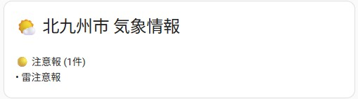
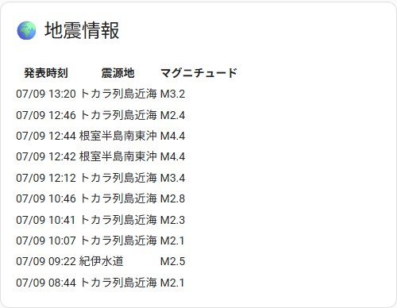

# JMA Disaster Information - Home Assistant Integration

A Home Assistant custom integration that provides real-time disaster information for Japan, including weather warnings and earthquake data from the Japan Meteorological Agency (JMA) BOSAI API.

## Features

- **Weather Warnings & Advisories**: Real-time alerts for thunderstorms, heavy rain, strong winds, snow, and other weather-related warnings with city-level precision
- **Earthquake Information**: Live earthquake data with recent 10 earthquakes history, flexible filtering by time range, magnitude, and intensity
- **Multi-Region Support**: Monitor multiple areas (home, workplace, family locations)
- **Hierarchical Area Selection**: Choose from region → prefecture → municipality
- **Advanced Dashboard Cards**: Conditional cards, time-filtered earthquake displays, and comprehensive disaster information dashboards
- **Home Assistant Automation**: Trigger automations based on disaster alerts
- **HACS Compatible**: Easy installation through Home Assistant Community Store

## Quick Start

1. Install via HACS
2. Add Integration: **Settings** → **Devices & Services** → **Add Integration** → Search "JMA Disaster Information"
3. Select your area: Region → Prefecture → Municipality
4. Configure update interval (default: 10 minutes)

---

# 気象庁防災情報 Home Assistant統合

気象庁の公式BOSAI APIを使用して、リアルタイムの防災情報をHome Assistantで利用できるカスタム統合です。

## 主な機能

- **特別警報・警報・注意報**: 雷、大雨、強風、大雪など各種気象情報をリアルタイム取得
- **地震情報**: 全国の地震情報を取得、直近10件の地震データを保持

## 対応している発令種類

### 特別警報
- 暴風雪特別警報
- 大雨特別警報  
- 暴風特別警報
- 大雪特別警報
- 波浪特別警報
- 高潮特別警報
- 土砂災害特別警報

### 警報
- 暴風雪警報
- 大雨警報
- 洪水警報
- 暴風警報
- 大雪警報
- 波浪警報
- 高潮警報
- 土砂災害警報
- 大雨危険警報
- 高潮危険警報
- 土砂災害危険警報

### 注意報
- 大雨注意報
- 洪水注意報
- 大雪注意報
- 風雪注意報
- 雷注意報
- 強風注意報
- 波浪注意報
- 融雪注意報
- 高潮注意報
- 濃霧注意報
- 乾燥注意報
- なだれ注意報
- 低温注意報
- 霜注意報
- 着氷注意報
- 着雪注意報
- 土砂災害注意報
- その他の注意報

## インストール方法

### HACS経由（推奨）

1. Home AssistantのHACSを開く
2. 「統合」をクリック
3. 右上の「...」から「カスタムリポジトリ」を選択
4. リポジトリURL: `https://github.com/heartstatnet/ha-disasterinformation`
5. カテゴリ: 「Integration」を選択
6. 「追加」をクリック
7. 「JMA Disaster Information」を検索してダウンロード
8. Home Assistantを再起動

### 手動インストール

1. [リリースページ](https://github.com/heartstatnet/ha-disasterinformation/releases)から最新版をダウンロード
2. `custom_components/disasterinformation`フォルダをHome Assistantの`custom_components`ディレクトリにコピー
3. Home Assistantを再起動

## 設定方法

1. **設定** → **デバイスとサービス** → **統合を追加**
2. 「JMA Disaster Information」を検索
3. 設定手順に従って進む:
   - **地方選択**: 北海道地方、東北地方、関東甲信地方など
   - **都道府県選択**: 選択した地方内の都道府県
   - **市区町村選択**: 選択した都道府県内の市区町村
   - **更新間隔**: データ取得間隔を設定（最小5分、デフォルト10分）
4. 「送信」をクリックして設定完了

### 複数地域の追加

設定プロセスを繰り返すことで、複数の地域を追加できます。各地域は個別のデバイスとして作成され、独自のセンサーセットを持ちます。

## エンティティ

この統合では、2つのタイプのエンティティが提供されます：

### 1. 特別警報・警報・注意報エンティティ（地域選択時）

設定した地域ごとに、`[都道府県名] [市区町村名] 気象庁防災情報`という名前のデバイスが作成されます。

#### 特別警報・警報・注意報センサー (`sensor.[地域名英語]_weather_alert`)
- **状態**: 発表中の特別警報・警報・注意報の概要（例：「雷注意報」、「大雨警報」、「特別警報(大雨)」、「発表なし」）
- **主要属性**:
  - `warnings`: 警報のリスト（名前、重要度、地域コード、状態）
  - `advisories`: 注意報のリスト（名前、重要度、地域コード、状態）
  - `emergency_warnings`: 特別警報のリスト
  - `warning_count`: 発表中の特別警報・警報・注意報数
  - `status`: 全体状態（「特別警報発表中」、「警報発表中」、「注意報発表中」、「発表なし」）
  - `last_update`: 最終更新時刻

**エンティティ名の例**:
- 北九州市: `sensor.fukuoka_kitakyushu_weather_alert`
- 那覇市: `sensor.okinawa_naha_weather_alert`
- 東京都千代田区: `sensor.tokyo_chiyoda_weather_alert`

**対応するバイナリセンサー**:
- 特別警報: `binary_sensor.[都道府県]_[市区町村]_special_warnings`
- 警報: `binary_sensor.[都道府県]_[市区町村]_warnings`
- 注意報: `binary_sensor.[都道府県]_[市区町村]_advisories`

### 2. 地震情報エンティティ

#### 地震情報センサー (`sensor.earthquake`)
- **状態**: フィルタ条件に該当する地震数（例：「3件の地震」、「該当する地震なし」）
- **主要属性**:
  - `recent_earthquakes`: **直近10件の地震情報**
    - `report_datetime`: 報告日時
    - `hypocenter`: 震源地
    - `magnitude`: マグニチュード
  - `latest_earthquake`: 最新地震の詳細情報
  - `earthquake_count`: フィルタ条件に該当する地震数
  - `time_range_hours`: 検索時間範囲（時間）
  - `min_magnitude`: 最小マグニチュード

**対応するバイナリセンサー**:
- 地震検知: `binary_sensor.earthquake_detected`

**注意**: 地震情報は全国対象のため、地域名は含まれません。

## ダッシュボードカード

### 気象警報・注意報カード
北九州市の気象警報・注意報を表示します：



```yaml
type: conditional
conditions:
  - entity: sensor.fukuoka_kitakyushu_weather_alert
    state_not: 発表なし
card:
  type: markdown
  title: 🌤️ 北九州市 気象情報
  content: >
       


    
     <div
    style="background: #000000; color: white; padding: 12px; border-radius: 8px;
    margin: 8px 0; font-weight: bold;"> <div style="font-size: 16px;
    margin-bottom: 8px;">🚨 特別警報 ({{ special_warnings|length }}件)</div>  <div style="font-size: 14px;">• {{ warning
    }}</div>  </div> 

      <div style="background: #663399; color: white;
    padding: 12px; border-radius: 8px; margin: 8px 0; font-weight: bold;"> <div
    style="font-size: 16px; margin-bottom: 8px;">⚠️ 警報 ({{ warnings|length
    }}件)</div>  <div style="font-size: 14px;">• {{
    warning }}</div>  </div> 

      <div style="background: #FFFF00;
    color: #000000; padding: 12px; border-radius: 8px; margin: 8px 0;
    font-weight: bold;"> <div style="font-size: 16px; margin-bottom: 8px;">🟡
    注意報 ({{ advisories|length }}件)</div>  <div
    style="font-size: 14px;">• {{ advisory }}</div>  </div> 

```

### 地震情報カード
直近24時間の地震情報を詳細表示します：



```yaml
type: markdown
title: 🌍 地震情報
content: >
   


   


  | 発表時刻 | 震源地 | マグニチュード |

  |----------|--------|----------------|

  

  | {{ as_timestamp(strptime(eq.report_datetime, '%Y-%m-%dT%H:%M:%S%z')) |
  timestamp_custom('%m/%d %H:%M') }} | {{ eq.hypocenter }} | M{{ eq.magnitude }}
  |

    **直近の地震**: 該当する地震はありません 

```

## データソース

この統合は[気象庁防災情報API（BOSAI API）](https://www.jma.go.jp/bosai/)をデータソースとして使用しています。

- **更新頻度**: 設定可能（最小5分、デフォルト10分）
- **認証**: 不要（公開API）
- **フォーマット**: JSON形式
- **対象範囲**: 日本全国の都道府県・市区町村

## ライセンス

このプロジェクトはMITライセンスの下でライセンスされています。詳細は[LICENSE](LICENSE)ファイルを参照してください。

## サポート

- **ドキュメント**: [GitHubリポジトリ](https://github.com/heartstatnet/ha-disasterinformation)
- **問題報告**: [バグ報告や機能要求](https://github.com/heartstatnet/ha-disasterinformation/issues)
- **ディスカッション**: [コミュニティディスカッション](https://github.com/heartstatnet/ha-disasterinformation/discussions)

## 免責事項

この統合は参考目的で防災情報を提供します。常に政府公式の発表や避難指示に従ってください。開発者は、この統合の使用により生じる可能性のある損害や損失について責任を負いません。

---

**JMA Disaster Information - Home Assistant Integration**  
日本の公式防災情報をスマートホームに。